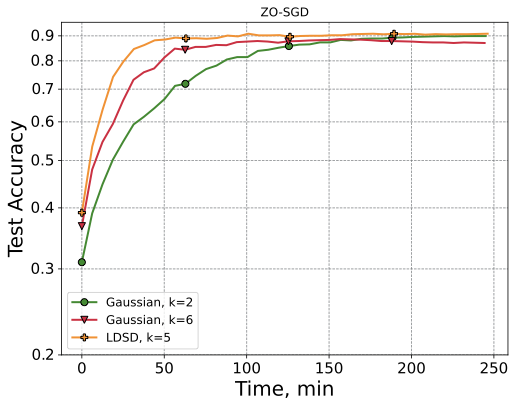
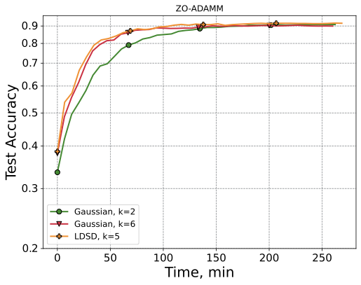
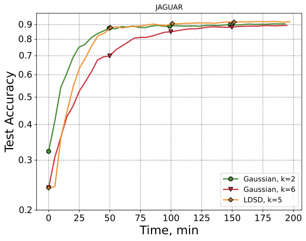

# Zero-Order Optimization for LLM Fine-Tuning via Learnable Direction Sampling

This repository contains the code for experiments applying ZO-LDSD framework for different LLM Fine-Tuning tasks.

The code is based on the [benchmark](https://github.com/ZO-Bench)

## Requirements

To install requirements:

```setup
pip install -r requirements.txt
```

## Training and Evaluation

To train and evaluate the model in the paper, run this command:

```
./run_script.sh
```

## Methods 

* `zo_rl_sgd` is ZO-SGD with LDSD-based sampling
* `zo_rl_adamm` is ZO-Adamm with LDSD-based sampling
* `zo_rl_jaguar` is Jaguar SignSGD with LDSD-based sampling

## Wallclock-time graphics

<table>
  <tr>
    <td align="center" width="33%">
      <a href="additional_graphics/walltime_sgd.pdf">
        
      </a>
    </td>
    <td align="center" width="33%">
      <a href="additional_graphics/walltime_adamm.pdf">
        
      </a>
    </td>
    <td align="center" width="33%">
      <a href="additional_graphics/walltime_jaguar.pdf">
        
      </a>
    </td>
  </tr>
  <tr>
    <td align="center">ZO-SGD</td>
    <td align="center">ZO-Adamm</td>
    <td align="center">JAGUAR</td>
  </tr>
</table>
